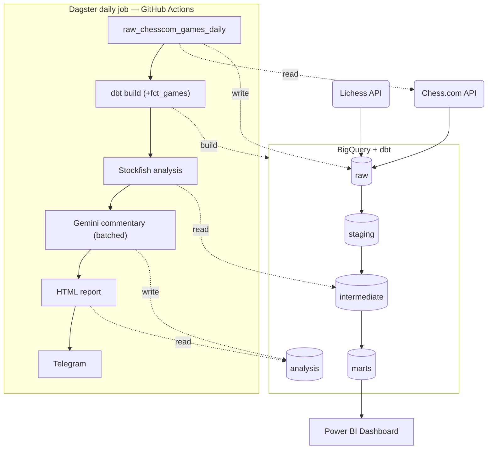
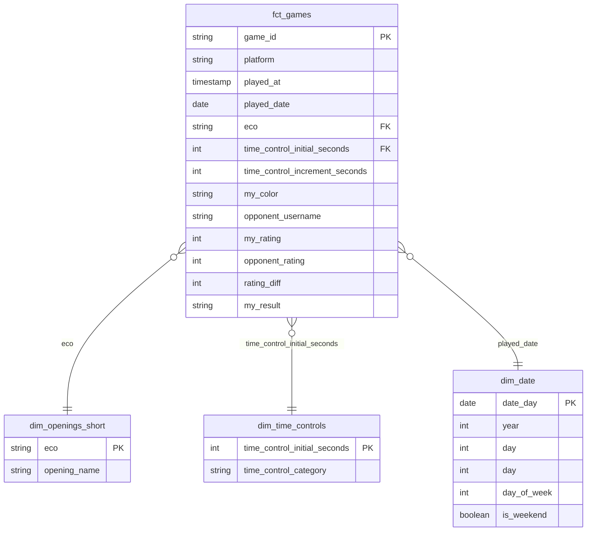

# Chess Analytics

[](https://github.com/dmytryk28/chess-analytics/actions/workflows/daily_pipeline.yml)

An end-to-end ELT pipeline that unifies my Lichess and Chess.com game history into a single warehouse, and runs an automated daily job that pulls new games, flags my mistakes with [Stockfish](https://stockfishchess.org/) (chess engine), explains them in plain English with Gemini, and delivers an HTML report to Telegram — every day, with no manual steps.

Built as a personal data engineering project with the modern ELT stack (Python, BigQuery, dbt, Dagster).

## What it does

- **Unifies two chess platforms.** 5 years of history from Lichess and Chess.com, normalized into one schema despite different API shapes.
- **Transforms with dbt.** Raw JSON → staging → intermediate → a star-schema mart, with tests on every layer.
- **Orchestrates with Dagster.** The daily job is a real asset graph — dbt models, Python steps, and their dependencies are all individually tracked.
- **Analyzes every game with Stockfish.** Every move I play is evaluated, mistakes are measured as win-probability loss.
- **Explains mistakes with Gemini.** Flagged moves are batched into a single structured-output request per run, with automatic fallback across models if a free-tier quota is hit.
- **Ships a daily report.** A self-contained HTML report (board diagrams + explanations) and a short digest land in Telegram automatically, every day, via GitHub Actions + cron-job.org.
- **Feeds a Power BI dashboard.** The full 5-year history is transformed into win rates of openings, rating trends, time-of-day performance, etc.

## Stack

| Layer | Tool |
|---|---|
| Sources | Lichess API, Chess.com API |
| Warehouse | Google BigQuery |
| Transformation | dbt Core (dbt-bigquery) |
| Orchestration | Dagster + `dagster-dbt` |
| Chess engine | Stockfish |
| LLM | Gemini API (structured output, batched, multi-model fallback) |
| Notifications | Telegram Bot API |
| BI | Power BI |
| CI/scheduling | GitHub Actions (`workflow_dispatch`) triggered by an external cron |

## Architecture



Historical backfill (5 years, both platforms) runs once, locally. The daily job runs unattended in GitHub Actions, triggered externally via [cron-job.org](https://cron-job.org) after GitHub's own `schedule` trigger proved unreliable.

## Data model

Star schema in the `marts` dataset:



`fct_games` also feeds two pre-aggregated marts: `mart_opening_performance` (win rate per opening, per color) and `mart_time_of_day_performance` (win rate per hour/weekday).

**Full interactive lineage graph** can be browsed here.

## Repository structure

```
chess-analytics/
├── extractors/            # Lichess/Chess.com API clients, BigQuery loader
├── chess_analytics_dbt/   # dbt project: staging, intermediate, marts
├── orchestration/         # Dagster assets, jobs, resources
├── analysis/              # Stockfish runner, Gemini summarizer, HTML rendering
├── telegram_bot/          # Notification client
└── .github/workflows/     # Daily pipeline CI
```

## Some engineering decisions

- **`raw` tables are schema-on-read.** A single JSON string column, regardless of source. Field-name collisions and type drift between two different APIs are handled entirely in dbt.
- **The daily job only rebuilds `fct_games`**, not the full marts layer — `dbt_select="+fct_games"` keeps the daily run fast, since Power BI's historical marts don't need a daily refresh.
- **Gemini requests are batched per run**, since the free tier's tightest limit is requests/day — turning dozens of per-move calls into a handful. Falls back across model versions if a quota is still hit.
- **Flagged moves are sorted by win% loss before batching**, so the biggest mistakes are analyzed first — if a batch fails partway through, the worst mistakes analysis is still saved.
- **Stockfish and Gemini results are merged into one row per move** before writing to BigQuery, appended in batches to a single shared table — avoiding a separate insert-then-update step and the multiple join for report creating.

## Power BI report

Sample dashboard:


